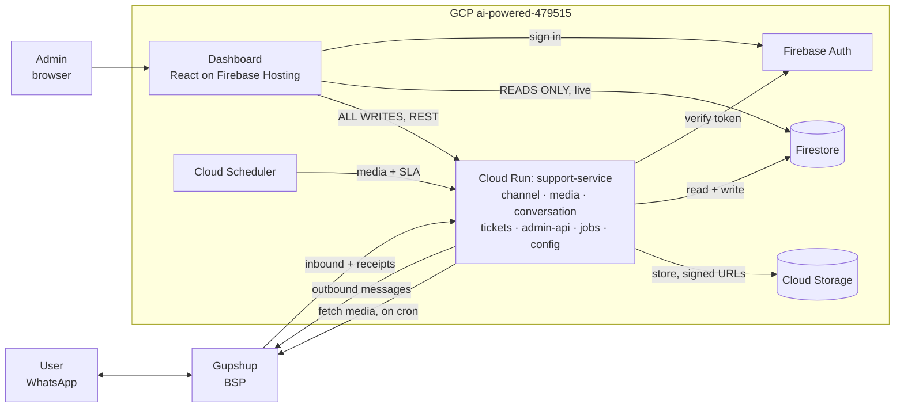

# Support System — Architecture & Design

| | |
|---|---|
| **Product** | WhatsApp support & ticketing for i3w.ai products (Anganwadi VR, German AI, Poshan AI) |
| **Users** | Field users on WhatsApp · one admin on a web dashboard |
| **Database** | Firestore (system of record) |
| **Backend** | Python 3.12 + FastAPI on Cloud Run |
| **Hosting** | GCP project `ai-powered-479515` |
| **Status** | Design complete · not built |
| **Date** | 7 Sep 2026 |

---

## 1. Decisions locked

| Area | Decision | Note |
|---|---|---|
| Database | Firestore | Settled, not revisited |
| Backend | Python 3.12 + FastAPI | Dashboard stays TypeScript — two languages |
| Deployment | One Cloud Run service, 7 modules | No microservices, no Cloud Functions |
| Dashboard reads | Direct to Firestore via client SDK | Gives live updates free |
| Dashboard writes | REST API only | Status rules + WhatsApp sending in one place |
| Access | Single admin, no roles | Identity read from token so a 2nd user needs no rewrite |
| Ticket model | Multiple open per contact, one per product | Enables the disambiguation list |
| Storage root | Contacts, not tickets | Conversations kept even with no ticket |
| Media | Fetched by 2-min cron, never inline | Cloud Run throttles CPU between requests |
| Email | Out of scope entirely | SLA alerts become a dashboard queue |
| Queue | None | Two crons cover all async work |

---

## 2. Components

| Component | Role | Talks to |
|---|---|---|
| WhatsApp user | Reports problems, sends photos/video | Gupshup |
| Gupshup (BSP) | WhatsApp Business API provider | Cloud Run (both directions) |
| Cloud Run `support-service` | Webhook, bot, ticket logic, admin API, crons | Firestore, Storage, Auth, Gupshup |
| Firestore | System of record | Cloud Run (RW), dashboard (read only) |
| Cloud Storage | Photos and video | Cloud Run |
| Firebase Auth | Admin identity | Dashboard, Cloud Run |
| Firebase Hosting | React dashboard (static) | Firestore, Cloud Run API |
| Cloud Scheduler | 2-min media pickup · hourly sweep | Cloud Run |

---

## 3. Modules

| Module | Owns | Exposes |
|---|---|---|
| `channel` | Gupshup payloads, signature check, dedupe, send, template-vs-freeform, receipts | Normalize a webhook · send text or template · report delivery |
| `media` | Fetch from expiring URLs, write to Storage, retry state, signed URLs | Fetch all pending · mint read URL |
| `conversation` | Bot step machine, inbound routing, contact identity, message log | Handle one inbound message, return replies |
| `tickets` | Lifecycle, transitions, numbering, events, SLA, resolution dispatch | Create · change status · send resolution · list open |
| `admin-api` | REST surface, token verification, validation | Nothing — boundary only |
| `jobs` | 2-min media pass · hourly SLA, retries, session cleanup | Run either pass (idempotent) |
| `config` | Products, categories, languages, copy, thresholds | Read products · categories · copy · settings |

**Rule:** `conversation` and `tickets` never import Gupshup types — only normalized shapes. BSP swap = one module.

---

## 4. Flows

### 4.1 User reports a problem

1. `channel` verifies secret, records provider message id. Already seen → 200 and stop.
2. Normalize payload, append to `contacts/{number}/messages`.
3. Media attached → write placeholder, state `pending`. Nothing waits.
4. `conversation` runs the step: language → product → name → centre → category → description.
5. Final step, one transaction: allocate number, write ticket, write event, stamp ticketId on messages, update `openTicketIds`, clear session.
6. Send confirmation, return 200.
7. Within ~2 min the media cron fetches the file to Cloud Storage, flips to `stored`.
8. Dashboard listener shows the ticket immediately.

### 4.2 Admin works a ticket

1. Sign in → Firebase ID token.
2. Dashboard opens Firestore listener on tickets, filtered by product and status.
3. Open ticket → listeners on events and the contact's messages. Attachments via 15-min signed URLs.
4. `pending` attachments render as "still arriving", not broken.
5. Mark in progress → POST to API → transition validated → status + event in one transaction.

### 4.3 Admin resolves

1. Submit resolution → POST to API (dashboard cannot write it).
2. Validate `in_progress → resolved`; write status, text, timestamp, event in one transaction.
3. `channel` checks `lastInboundAt`: inside 24h → free text; outside → approved template in user's language.
4. Send fails → stays `resolved`, `deliveryState: failed`, appears in needs-retry. Hourly sweep retries once.
5. Delivery receipt arrives → ticket moves to `closed`.
6. **Closed = reached their phone**, not "we sent something".

---

## 5. Firestore schema

### `contacts/{waNumber}` — root record, one per phone number

| Field | Type | Notes |
|---|---|---|
| `waNumber` | string | E.164 without plus. Also the doc id |
| `displayName` | string \| null | Learned once, reused — bot stops asking |
| `centreName` | string \| null | Free text. Centres are not a separate entity |
| `language` | `en`\|`hi`\|`te`\|`ta` | Sticky across conversations |
| `session` | Session \| null | In-flight flow. Null = idle. Only one at a time |
| `session.flow` | `report`\|`disambiguate` | Which script is running |
| `session.step` | string | Key into the step table (§7) |
| `session.draft` | map | Partial answers, discarded on completion |
| `session.startedAt` | Timestamp | Older than 24h → cleared by sweep |
| `openTicketIds` | string[] | Tickets not yet closed. Read on every inbound |
| `lastInboundAt` | Timestamp | **Load-bearing** — decides freeform vs template |
| `lastOutboundAt` | Timestamp \| null | Diagnostics |
| `createdAt` / `updatedAt` | Timestamp | |

> **Invariant:** `openTicketIds` is written only inside the transaction that opens or closes a ticket. A stale value here misroutes messages.

### `contacts/{waNumber}/messages/{messageId}`

| Field | Type | Notes |
|---|---|---|
| `messageId` | string | Provider id for inbound (makes writes idempotent), ULID for outbound |
| `direction` | `in`\|`out` | |
| `ticketId` | string \| null | **Key.** Null = said outside any ticket. This FK, not a range, links messages to tickets |
| `type` | `text`\|`image`\|`video`\|`document`\|`interactive` | |
| `text` | string \| null | Body, caption, or tapped list-row label |
| `attachment.state` | `pending`\|`stored`\|`failed` | Starts pending, always |
| `attachment.storagePath` | string \| null | Set on `stored`. Never a provider URL — those expire |
| `attachment.mimeType` / `sizeBytes` | string / number | Video capped at 16 MB by WhatsApp |
| `attachment.attempts` | number | Gives up at 5 |
| `sentVia` | `freeform`\|`template`\|null | Outbound only. Audits template spend |
| `providerStatus` | `queued`\|`sent`\|`delivered`\|`read`\|`failed`\|null | Outbound only |
| `createdAt` | Timestamp | |

> **Invariant:** Append only. Only `attachment.state` and `providerStatus` change after write.

### `tickets/{ticketId}` — id `TKT-YYYYMMDD-NNNN`

| Field | Type | Notes |
|---|---|---|
| `waNumber` | string | Denormalized |
| `contactName` / `centreName` | string | **Snapshot** at creation, never updated |
| `serviceId` / `serviceName` | string | Denormalized — list view needs no join |
| `categoryId` / `categoryLabel` | string | Category belongs to the product |
| `language` | enum | Which language to resolve in |
| `description` | string | The problem as typed |
| `attachmentCount` | number | Paperclip in list view without reading messages |
| `status` | `open`\|`in_progress`\|`resolved`\|`closed` | See §8 |
| `slaState` | `ok`\|`reminder_due`\|`breached` | Written only by the sweep |
| `resolution` | map \| null | text, sentAt, deliveryState, attempts |
| `createdAt` / `updatedAt` | Timestamp | |
| `firstResponseAt` | Timestamp \| null | Did anyone look at this |
| `resolvedAt` / `closedAt` | Timestamp \| null | Sent vs delivered |

> **Invariant:** At most one ticket with `status != closed` per (waNumber, serviceId). Checked against `openTicketIds` inside the creation transaction.

### `tickets/{ticketId}/events/{eventId}` — append-only audit

| Field | Type | Notes |
|---|---|---|
| `type` | `created`\|`status_changed`\|`note`\|`resolution_sent`\|`delivered`\|`sla_flagged`\|`media_failed`\|`message_added` | Closed set |
| `from` / `to` | string \| null | For status_changed and sla_flagged |
| `actor` | `bot`\|`admin`\|`system` | System = the sweep |
| `actorUid` | string \| null | Present now so a 2nd user needs no migration |
| `note` | string \| null | Admin notes, failure reasons |
| `at` | Timestamp | |

### `services/{serviceId}` — slugs: `anganwadi-vr`, `german-ai`, `poshan-ai`

| Field | Type | Notes |
|---|---|---|
| `name` | map<lang,string> | Localized display name |
| `enabled` | boolean | Disabling hides from bot, keeps history readable |
| `order` | number | Row order in the WhatsApp list |
| `categories` | Category[] | `{ id, label: map<lang,string>, order, enabled }` |

> **Invariant:** Enabled services ≤ 10, enabled categories per service ≤ 10. WhatsApp lists hard-cap at 10 rows. API rejects the 11th.

### Supporting collections

| Path | Shape | Notes |
|---|---|---|
| `config/settings` | map | slaReminderHours 24, slaBreachHours 48, whatsappWindowHours 24, sessionExpiryHours 24, retentionDays 365 |
| `config/languages` | map | Offered languages and native labels |
| `config/copy/{lang}` | map<key,string> | Every bot string. Copy edits are writes, not deploys |
| `inbound/{providerMessageId}` | `{ receivedAt, expiresAt }` | Existence is the whole signal. TTL 30 days |
| `counters/{yyyymmdd}` | `{ seq: number }` | Ticket sequence, incremented in transaction |

---

## 6. Inbound routing — first match wins

| # | Condition | Action |
|---|---|---|
| 1 | Message has a reply-context to one of our outbound messages | Route to that message's `ticketId` |
| 2 | Contact has an active session | Treat as the answer to the current step |
| 3 | No open tickets | Start the report flow |
| 4 | Exactly one open ticket | Append to it, log `message_added`, surface on dashboard |
| 5 | Two or more open tickets | Send interactive list of open tickets by product name + "Report a new problem". Set `disambiguate` session |

- Choosing a product that already has an open ticket → append to it and reply with that ticket number. No duplicate.
- List shows **product names**, not ticket numbers — `TKT-20260907-0042` means nothing to a field user. The one-per-product rule exists mainly to make this list readable.

---

## 7. Bot step machine (report flow)

| Step | Bot sends | Accepts | On invalid | Next |
|---|---|---|---|---|
| `language` | Numbered language list | List reply or digit | Re-send once, then default English | `service` |
| `service` | Interactive list of enabled products | List reply | Re-send | `name` |
| `name` | "Please share your name" | Text, 1–80 chars | Re-ask | `centre` |
| `centre` | "Your Anganwadi name" | Text, 1–120 chars | Re-ask | `category` |
| `category` | Interactive list from chosen product | List reply | Re-send | `description` |
| `description` | "Describe the issue. Photo or video welcome." | Text and/or media, until done signal or 90s idle | Accept anything; media with no text is valid | create ticket |
| — | Ticket confirmation with number and summary | — | — | session cleared |

- **Returning contacts skip two steps.** If `displayName` and `centreName` exist, jump product → category. Second ticket is 3 taps, not 6.
- **Abandoned sessions** older than `sessionExpiryHours` are cleared by the sweep. No ticket. Messages stay on the contact.

---

## 8. Status transitions, transactions, indexes

### Legal transitions — anything else returns 409

| From | To | Trigger |
|---|---|---|
| — | `open` | Flow completed |
| `open` | `in_progress` | Admin takes it |
| `in_progress` | `open` | Admin puts it back |
| `in_progress` | `resolved` | Resolution sent |
| `open` | `resolved` | Admin resolves without taking |
| `resolved` | `closed` | Delivery receipt |
| `resolved` | `in_progress` | Send failed permanently |
| `closed` | `open` | Contact writes within 7 days |

Enforced in `tickets`, not security rules — rules cannot express "only if previous value was X".

### Transactional operations

| Operation | Writes in one commit |
|---|---|
| Create ticket | Read contact → check invariant → increment counter → write ticket → write event → update `openTicketIds` → clear session |
| Change status | Read ticket → validate → write status → write event → on close, remove from `openTicketIds` |
| Reopen | As above, plus re-add to `openTicketIds` and re-check the invariant |

**Not transactional (by design):** appending a message, updating attachment state, stamping SLA state. These converge; nothing depends on their atomicity.

### Composite indexes required

| Collection | Fields | Serves |
|---|---|---|
| `tickets` | status ASC, createdAt DESC | Default queue |
| `tickets` | serviceId ASC, status ASC, createdAt DESC | Filter by product |
| `tickets` | slaState ASC, createdAt ASC | Needs-attention view, sweep |
| `tickets` | status ASC, updatedAt ASC | Sweep for overdue and failed sends |
| `messages` (group) | ticketId ASC, createdAt ASC | Ticket detail conversation |
| `messages` (group) | attachment.state ASC, createdAt ASC | Media retry pass |

---

## 9. API surface

All admin routes require a verified Firebase ID token. Cron routes use an OIDC token.

| Method & path | Body | Effect | Fails with |
|---|---|---|---|
| `POST /webhook/gupshup` | Gupshup payload | Dedupe, normalize, append, run flow, reply | 401 bad secret |
| `POST /webhook/gupshup/status` | Delivery receipt | Update providerStatus; close ticket if resolution | 401 |
| `PATCH /tickets/:id/status` | `{ to, note? }` | Validated transition + audit event | 409 illegal transition |
| `POST /tickets/:id/resolution` | `{ text }` | Write resolution, move to resolved, dispatch | 409 wrong status, 502 send failed |
| `POST /tickets/:id/notes` | `{ text }` | Append note event. Never sent to user | 404 |
| `POST /tickets/:id/resend` | — | Retry a failed resolution send | 409 nothing to resend |
| `GET /attachments/:messageId/url` | — | Signed read URL, 15 min | 404, 409 not stored yet |
| `PUT /services/:id` | Service doc | Create/update product and categories | 422 over 10-row cap |
| `PUT /config/:key` | Config doc | Update copy, languages, settings | 422 invalid shape |
| `POST /jobs/media` | — | Fetch pending attachments. Cron, every 2 min | 401 |
| `POST /jobs/sweep` | — | SLA flagging, retries, abandoned sessions. Cron, hourly | 401 |

### Security rules — a read gate, nothing more

| Path | Read | Write |
|---|---|---|
| `tickets/**` | Signed in | Denied — server only |
| `contacts/**` | Signed in | Denied |
| `services/**`, `config/**` | Signed in | Denied |
| `inbound/**`, `counters/**` | Denied | Denied |
| Storage `attachments/**` | Denied — signed URLs only | Denied |

Every server write uses the Admin SDK, which bypasses rules. The whole rules file is "is there a signed-in user" plus two denials.

---

## 10. Tech stack

| Layer | Choice | Reason |
|---|---|---|
| Runtime | Python 3.12 | Firebase Admin SDK fully supported |
| HTTP | FastAPI + Uvicorn | Pydantic validation built in |
| Route style | **sync `def` handlers** | Firestore client is synchronous; FastAPI threadpools them. Do not mix in the async client |
| Data access | `firebase-admin` | Firestore, Auth verification, Storage signed URLs |
| Validation | Pydantic v2 | Validates at runtime — TypeScript types would not |
| Dependencies | `uv` | Lockfile, fast installs |
| Type checking | pyright in CI | Annotations are hints; the design leans on closed enums |
| Dashboard | React 18 + Vite + TypeScript | Browser app. This is the cost of Python: two languages |
| Dashboard data | firebase JS SDK | Auth + `onSnapshot` listeners. No React Query |
| Styling | Tailwind | One admin, no design system to maintain |
| Tests | pytest + Firebase Emulator Suite | Emulator is a standalone process — set `FIRESTORE_EMULATOR_HOST` |
| Rules tests | ~50 lines of Node | `@firebase/rules-unit-testing` is Node-only. The one real cost of Python |
| Deploy | Cloud Build → Cloud Run + Firebase Hosting | Dockerfile with uvicorn; static bundle |
| Secrets | Secret Manager | Gupshup key, webhook secret, as env vars |

---

## 11. Patterns

**Using**

| Pattern | Why |
|---|---|
| Modular monolith | One team, one traffic pattern. Split tickets by module, not service |
| Direct-read, API-write | Live updates free; rules in one place |
| Contact as aggregate root | Keeps abandoned conversations; supports interleaved tickets |
| Adapter at channel boundary | BSP swap is one module |
| Deferred media fetch, own state | 16 MB video cannot fail a ticket; dodges Cloud Run CPU throttling |
| State machine, state in DB | Cloud Run kills idle containers — memory sessions would vanish |
| Idempotent receiver | Webhook retries would otherwise duplicate tickets |
| Aggregate + append-only event log | Audit without event sourcing |
| Config as data, scoped per product | Adding a 4th product is a document, not a deploy |
| Two crons, no queue | Cloud Scheduler free to 3 jobs at any frequency |

**Not using**

| Refused | Reason |
|---|---|
| Microservices | Multiplies deploys and debugging for no gain |
| Message queue | Media retries are rare and unordered; crons cover it |
| Roles and permissions | One account. Read identity from token, build nothing more |
| Assignment, per-agent stats | Meaningless with one admin |
| Event sourcing / split read models | Denormalized ticket fields serve every view |
| Cloud Functions per endpoint | Two runtimes, worse local testing, more cold starts |
| GraphQL | One client, a dozen endpoints |
| Search service | Firestore covers product/status/category/date. Substring search is the gap |
| Websockets | Firestore listeners already are one |
| Email | Out of scope by decision |

---

## 12. Out of scope

| Item | Status | Note |
|---|---|---|
| Email, entirely | **Excluded** | SLA reminders become an in-dashboard queue. With one admin, nobody is interrupted if they are not looking |
| Out-of-band alerting | Later | Cheapest is a WhatsApp template to the admin's own number |
| Multiple agents, roles, assignment | Later | Seam left: identity read from token |
| Reporting across products | Later | Mirror to BigQuery when needed |
| Admin conversational replies | Later | Needs human-takeover state and per-exchange window tracking |
| Media transcoding, thumbnails, virus scan | Later | Purely additive |

---

## 13. Failure modes

| Failure | Detected by | Response | Recovery |
|---|---|---|---|
| Gupshup redelivers a webhook | Existing `inbound` doc | Return 200, do nothing | By design |
| Media fetch fails | media, on 2-min pass | Stays `pending`, ticket unaffected | Retried every 2 min, 5 attempts, then `failed` |
| Outbound send fails | Gupshup API error | Stays `resolved`, `deliveryState: failed` | Hourly retry; admin can force `/resend` |
| Template not approved for a language | Gupshup rejects | Fall back to English template, log event | Admin sees mismatch on ticket |
| 24h window closed, no template | channel, pre-send | Refuse to send, mark ticket blocked | Surfaced on dashboard — setup problem, not runtime |
| Counter contention | Firestore | SDK retries automatically | Irrelevant at pilot volume |
| Session abandoned mid-flow | Sweep | Session cleared, no ticket | Messages retained on contact |
| Cold start on a quiet night | — | Prevented by one warm instance | The only GCP line item that matters |

---

## 14. Open questions

| # | Question | Changes |
|---|---|---|
| 1 | Does "48-hour resolution" mean **sent** or **delivered**? | Which timestamp the SLA measures; the sweep's logic |
| 2 | Is the product list stable, or do products come and go often? | Whether `config` is scaffolding or a real admin surface |
| 3 | Must the admin search chat text or partial names? | Adds a search service — the only thing that changes the diagram |
| 4 | Reopen collides with an occupied product slot — merge, or relax the invariant? | Reopen rule and the routing table (§6) |
| 5 | Two languages at launch or four? | Meta template approval × N, plus who writes Telugu and Tamil copy |
| 6 | With no email and one admin, is a dashboard queue enough for SLA breaches? | Whether an outbound alerting path exists at all |

---

## 15. Cost — pilot scale (~100 centres, ~400 tickets/month)

| Line | ₹ / month |
|---|---|
| Cloud Run, one warm instance | 850–1,100 |
| Cloud Run requests, Firestore, Storage, Hosting, Auth, Scheduler, Logging | 0 (free tiers) |
| Secret Manager | ~10 |
| Email provider | 0 (excluded) |
| Meta — bot conversations (user-initiated) | 0 |
| Meta — resolution templates (~400) | ~50 |
| Gupshup platform fee | **check your rate card** |
| **Predictable total** | **≈ 1,000** |

Storage grows with video (16 MB cap) plus one-year retention — watch volume, not price. Set a bucket lifecycle rule at build time.

---

*Firestore as system of record is settled. Schemas are contracts the code enforces, not Firestore-native constraints.*
